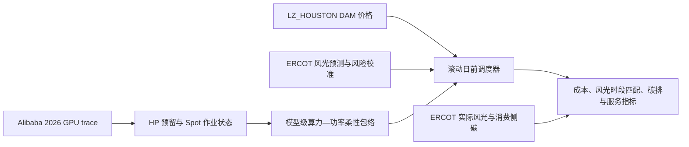

# ERCOT 2025 Houston × Alibaba 2026 Spot GPU：顶层研究设计

> 状态：已获研究方向认可，尚未进入数据扩充、建模或实验实施。
>
> 范围：仅论文线；不读取、修改或引用求职线材料。
> 版本：2026-08-17。

## 1. 研究定位

本文研究一个**反事实的单数据中心日前调度问题**：把 Alibaba 2026 Spot GPU trace 作为真实但未地理定位的 GPU 工作负载重放源，把 ERCOT `LZ_HOUSTON` 日前市场价格及 ERCOT 平衡区系统能源信号作为电力侧情景。它不声称 Alibaba 工作负载实际发生在 Houston，也不把 ERCOT 系统风光写成数据中心本地新能源。

论文的核心定位是“成本优先的、风险感知的 GPU 负载柔性调度”，而非本地风光—储能微电网设计。主结果必须是可运营的日前反事实评估，不能让调度器预先看到整个月的实际价格、实际风光或未来 HP 作业到达。

## 2. 研究问题与待检验命题

### 2.1 主研究问题

在严格优先 HP GPU 作业与可延迟 Spot GPU 作业共存时，如何从真实作业请求、异构 GPU 容量和功率假设中构造一个可执行的“算力—功率柔性包络”，并在公开的 ERCOT 日前价格和风光预测信息下，最小化运行成本，同时改善 Spot 执行与系统级风光出力的时间匹配、降低消费侧碳排？

### 2.2 可证伪命题

1. 与静态配额及无能源感知调度相比，风险感知 HP 预留下的 Spot 柔性调度可降低增量设施运行成本，且不会产生 HP 容量侵占。
2. 在预注册的成本容忍度内，加入系统风光和消费侧碳信号可改善 Spot 负载的可再生能源时段匹配并降低碳排。
3. 上述结论在四个季节窗口和预注册的功率参数情景中保持方向一致；若不成立，如实报告负结果和适用边界。

“HP 服务保障”仅表示仿真中通过硬容量约束或实时抢占实现的隔离，不表示 trace 观测到了真实 HP SLO、实际排队时间或真实抢占行为。

## 3. 贡献边界

预期贡献为：

1. 用近期公开 HP/Spot GPU trace 构造按 GPU 型号区分、可审计的算力—功率柔性包络；
2. 将 HP 风险预留、异构 GPU 功率映射、DAM 价格和可获得的系统风光预测纳入同一复现实验链；
3. 在成本近似最优的明确约束下，评估系统级风光时段匹配与消费侧碳的边际收益；
4. 明确区分数据观测值、反事实调度假设、预测信息与事后评价信号。

本文**不**把“价格感知调度”“HP 优先于 Spot”或“Spot 抢占”单独宣称为算法创新；这些是已有研究主题。本文的创新主张须以可审计包络、信息边界和严格实证组合为核心，并在正式写作前完成文献重合核查。

## 4. 研究系统

### 4.1 工作负载与容量层

- 对每个 GPU 型号 `m`，由节点 trace 得到总容量 `C_m`。
- HP 作业按请求 GPU 数、worker 数、提交时刻和持续时间构造实现容量预留：

  \[
  R^{HP}_{m,t}=\sum_{j\in HP,m}g_j\mathbf{1}(r_j\leq t<r_j+d_j).
  \]

- 实际执行时 Spot 容量必须满足 \(\sum_j g_jx_{j,t}\leq C_m-R^{HP}_{m,t}\)。在决策时不使用未来实现的 \(R^{HP}_{m,t}\)，而使用滚动预测值和高分位残差预留；实现值只用于事后评估与在线 HP 优先保护。
- Spot 作业保持模型类型和 gang GPU 请求。以“小时级、可检查点且可恢复”为反事实政策假设；任何恢复/抢占开销均只能作为单独敏感性情景，不能宣称为 trace 观测值。

### 4.2 功率层

采用增量设施功率模型：

\[
\Delta P^{facility}_t=PUE\,\kappa_{IT}\sum_m n_{m,t}u_mP^{TDP}_m.
\]

`PUE`、`\kappa_IT` 和 GPU 活跃功率比 `u_m` 是公开硬件资料支持下的情景参数，而非 Alibaba trace 或 Houston 数据中心的实测值。主结果使用一套预先固定的基准值，并至少报告低/基准/高三档功率敏感性。固定比例缩放只改变绝对成本和排放时，不得被误写为调度策略稳健性；还应检查异构 GPU 功率映射是否改变策略排序。

### 4.3 目标层

采用词典序而不是没有边界的加权求和：

1. 最小化 Spot 增量设施电力的 `LZ_HOUSTON` DAM 成本；
2. 在成本不超过第 1 项最优成本 1% 的集合中，最大化 Spot 执行与 ERCOT 系统风光出力的时间匹配；
3. 在前两项并列时，最小化仅由过去消费侧强度构建的碳预测信号。

“风光匹配”以系统级可再生能源出力的归一化/分位数暴露定义，并报告其 MWh 加权值；它不等价于数据中心直接消费了同等 MWh 的本地可再生电力。日前调度使用只由历史观测构建的碳预测；碳结果采用 EIA 已发布的消费侧强度，不表述为边际排放。

## 5. 时间设计与信息边界

### 5.1 主实验窗口

使用 ERCOT 2025 年四个固定的 30 天窗口：1 月 1 日、4 月 1 日、7 月 1 日和 10 月 1 日起。四个季节均重放同一个、按预先登记规则选出的 Alibaba 相对 30 天 workload core，以隔离电力侧季节性影响，避免根据结果挑选工作负载窗口。

每个窗口的主分析期为 720 小时。Spot 作业的默认额外完成宽限为 \(H=3\) 小时：

\[
\mathrm{deadline}_j=r_j+\lceil\mathrm{duration}_j\rceil+H.
\]

`H` 是政策参数，不是数据集给出的真实等待或 SLO。必须报告 \(H\in\{0,1,3,6\}\) 的敏感性。

### 5.2 结算尾段和初始状态

主资格上限预注册为 \(D_{max}=168\) 小时。因此，不再使用原先“720 小时 + 3 小时”快照；每个完整实验输入应为：

- 171 小时前置上下文，用于恢复 HP 预留和 inherited Spot 状态；
- 720 小时核心期，允许新的 Spot 到达；
- 171 小时结算闭合期，不再接收新的核心 Spot 作业，但持续调度直到最后可能的 \(D_{max}+H\) 截止点。

完整输入长度为 1,062 小时。前置阶段只用于形成所有方法相同的初始状态，不计入主要比较指标；核心到结算尾段的耗电、成本、碳排和未完成任务必须全部计入。1 月窗口需要补充 2024 年末的能源上下文数据，但它只用于初始状态，2025 年才是正式结果年份。

### 5.3 日前可得性

调度器按日滚动：对每个交割日，只使用该日已锁定的 DAM 价格、在预先登记的本地截止时刻之前发布的风光预测版本，以及仅由已完成历史小时训练的消费侧碳预测。实际风光、实际碳强度和未来 HP 预留只用于结果评价。整个月实际价格序列可用于事后计算成本，不能作为月初决策输入。

## 6. 数据合同

| 数据类别 | 主用途 | 事实边界 |
| --- | --- | --- |
| Alibaba 2026 Spot GPU job/node CSV | 作业到达、持续时间、HP/Spot 分类、GPU 型号与容量 | 无 Houston 地点、绝对日期、实际功率、实际排队、抢占或 SLO |
| ERCOT `LZ_HOUSTON` DAM | 成本信号 | 市场结算价格，不等于零售电价或实际数据中心账单 |
| ERCOT 风光预测及相应实际 HSL | 调度信息和预测误差校准 | 预测目标与发电量口径须按官方定义区分 |
| EIA ERCO 风光实际发电与消费侧碳 | 事后系统级匹配和排放评价；碳预测的历史训练 | 系统级信号，非 Houston 本地发电或边际碳 |

原始下载文件继续仅保存在 `data/energy/` 与 `data/workload/`，由 `.gitignore` 排除。数据来源、下载时间、SHA-256、时间口径、缺失值和处理脚本必须写入相应 README；可版本控制的是衍生且无原始大文件的输入清单、脚本、测试和窗口快照。

## 7. 方法与对照组

主方法应由两个可验证部分组成：

1. **柔性包络生成器**：从模型级可用容量、Spot 释放时刻、剩余工作量和截止期生成每小时可行的 GPU 功率范围；用逐作业可行性恢复/修复程序检验 gang 请求与截止期，不能只依赖连续容量松弛。
2. **滚动日前调度器**：在 DAM 成本主目标下分配下一日执行量，并以 HP 风险预留维持实际 HP 的绝对优先权；每日重新优化并传递未完成 Spot 工作量。

必须至少比较以下策略：

| 策略 | HP 保护 | 能源信号 | 作用 |
| --- | --- | --- | --- |
| B0：静态配额 EDF/最早可行 | 静态 | 无 | 传统容量基线 |
| B1：风险预留 EDF | 动态风险预留 | 无 | 隔离 HP 保护的贡献 |
| B2：价格感知 | 动态风险预留 | DAM 价格 | 电价移峰贡献 |
| P：所提方法 | 动态风险预留 | DAM + 风光预测 + 碳次级约束 | 完整方法 |

另以“已知未来 HP”与“已知未来系统信号”形成诊断上界，说明损失来自容量预测还是能源预测；这两组不能被称为可运营主结果。

## 8. 评价与判读

主指标为 Spot 增量设施电力的 USD 运行成本。辅助指标为：

- MWh 加权的系统风光时段匹配；
- kgCO2e 消费侧排放；
- Spot 完成率、到期未完成率、平均完成延迟及被抢占/修复量；
- HP 容量侵占次数（应为零）与实际残余容量短缺次数；
- 每日求解时间、可行性恢复成功率和最优性/求解缺口；
- 各 GPU 型号、季节窗口、`H` 值和功率参数情景下的结果。

四个 30 天窗口是代表性季节性情景，不是可用于显著性检验的独立大样本。论文应逐窗口报告结果、方向一致性和汇总值，避免把四个观测值包装成显著性结论。

## 9. 可行性门槛与回退规则

| 门槛 | 通过标准 | 合理回退 |
| --- | --- | --- |
| 历史预测可得性 | 取得带发布时间和目标时刻的官方风/光预测，能复现每个日前决策输入 | 仅用历史过去值训练无泄漏预测器，并改写为“统计预测”实验 |
| 功率标定 | GPU 型号映射、基准值和三档敏感性都有公开来源和配置记录 | 匿名 GPU 型号保留为不确定性情景，不伪造精确型号 |
| 调度可行性 | 代表性试验能在预设限时内完成并逐作业满足截止期 | 在不查看成本/碳结果前，统一把 `D_max` 从 168 小时改为 72 小时并公开覆盖率 |
| 信息无泄漏 | 日前决策日志只读取当日可得数据 | 该实现不得进入主结果，修复后重跑 |

这些门槛中，历史预测产品和 GPU 功率映射需要先核验；未验证前不能将其写成已完成的数据事实。

## 10. 两个月交付顺序

1. **第 1 周**：完成数据合同、历史预测获取与 2024 年末上下文补齐；修正时间语义并重建 1,062 小时输入。
2. **第 2 周**：完成 Alibaba workload core、HP 预留、Spot 作业资格和功率参数生成，写出单元测试。
3. **第 3–4 周**：实现柔性包络、可行性恢复和滚动日前调度；通过不看结果的规模可行性门槛。
4. **第 5 周**：运行四季 × 基线 × 主方法的核心实验，固定随机性、配置和输入哈希。
5. **第 6 周**：完成 `H`、功率、预测误差和长作业阈值敏感性；审计负结果与时间泄漏。
6. **第 7 周**：整理图表、数据限制、可复现附录与目标三区期刊范围。
7. **第 8 周**：完成英文初稿、内部审阅、引用核验和投稿材料。

## 11. 非目标与禁止表述

- 不把 ERCOT 系统级风光称为数据中心本地风电或本地光伏；
- 不把 EIA 消费侧碳强度称为边际碳排；
- 不把 Alibaba trace 中未出现的队列、检查点开销、抢占、功率或 HP SLO 描述为实测；
- 不把功率情景输出称为真实 Houston 数据中心的测量账单；
- 不把四个季节窗口结果称为统计显著性证据；
- 不将原始数据文件纳入 Git，也不混入求职线文件或文档。

## 12. 下一阶段

下一阶段只生成详细实施计划，不直接修改模型代码。该计划将分别列出数据获取、时间对齐、柔性包络、调度器、验证与论文产物，且把每项可行性门槛设为先于主实验的停止点。
